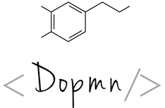

<div class='centered'>
    
</div>

## Dopmn - a lightweight Docker+PHP+MySQL+nginx dev environment

A quick solution for prototyping _MVC_ web apps with _Docker_ running _Nginx_, _PHP-FPM_, _Composer_, and _MySQL_.

>   **Dopmn** stands on the shoulders of these projects:
- [nanoninja/docker-nginx-php-mysql](https://github.com/nanoninja/docker-nginx-php-mysql)
- [panique/mini3](https://github.com/panique/mini3)

## Overview

1. [Prerequisites](#1-installation-prerequisites)

1. [Installing **Dopmn**](#2-to-install)

1. [Initializing the web app framework](#3-initializing-the-web-app)

1. [Running **Dopmn**](#4-to-start-developing)

    Two options while developing:
    - [Using `make`](#using-makefile)
    - [Using **Docker** commands](#using-docker-some-important-commands)

___

## 1. Installation prerequisites

This project has been mainly created for Unix `(Linux/MacOS)`. On Windows, caveat emptor ¯\_(ツ)_/¯.

You need to have at least these already installed:

* [Composer](https://packagist.org/packages/composer/composer)
* [Git](https://git-scm.com/downloads)
* [Docker](https://docs.docker.com/engine/installation/)
* [Docker Compose](https://docs.docker.com/compose/install/)  version 3

> To check if you have `docker-compose` installed:

```sh
    which docker-compose
```

> This is optional but makes for less command typing:

```sh
    which make
```

> On Ubuntu and Debian these are available in the meta-package *build-essential*:

        sudo apt install build-essential


### Docker images used

* [Nginx](https://hub.docker.com/_/nginx/)
* [MySQL](https://hub.docker.com/_/mysql/)
* [PHP-FPM](https://hub.docker.com/r/nanoninja/php-fpm/)
* [Composer](https://hub.docker.com/_/composer/)

___

## 2. To install

```sh
$ git clone https://github.com/islandjoe/dopmn.git
```

```sh
$ cd dopmn/
```

### Project tree

```sh
.
├── Makefile
├── README.md
├── composer.json
├── data/
│   └── db/
├── docker-compose.yml
├── etc/
│   ├── nginx/
│   └── php/
└── web/
    ├── app/
    └── public/
```

```sh
web
├── app/
│   ├── composer.json.dist
│   ├── phpunit.xml.dist
│   ├── src/
│   └── test/
└── public/
    ├── css/
    ├── img/
    ├── index.php
    └── js/
```

```sh
web/app/src
├── Controller/
│   ├── AbstractController.php
│   ├── ErrorController.php
│   └── HomeController.php
├── Core/
│   ├── Application.php
│   ├── Db.php
│   └── Foo.php
├── View/
│   ├── error/
│   ├── footer.php
│   ├── header.php
│   └── home/
└── config.php
```


## 3. Initializing the backend

1. Create a fresh copy of the composer configuration file:
(This is only done one time)

    ```sh
    (dopmn) $ cp web/app/composer.json{.dist,}
    ```

2. Start the application :

    ```sh
    (dopmn) $ docker-compose up -d
    ```

    If you want to follow log output:

    ```sh
    (dopmn) $ docker-compose logs -f
    ```

## 4. Initializing the frontend

```sh
(dopmn) $ composer install -d web/app
```

Open in browser :

 [http://localhost:8000](http://localhost:8000/)

### Ports used

| Server     | Port |
|------------|------|
| MySQL      | 8989 |
| Nginx      | 8000 |

Please refer to [Handling database](#handling-database)

## When you're done developing

To stop the Docker container and remove containers, networks, volumes, and images:

```sh
(dopmn) $ docker-compose down -v
```

___

## Using Makefile

To make less typing command mistakes, you can use [make](https://en.wikipedia.org/wiki/Make_(software)) for doing the following:

| Command             | Description                                  |
|---------------------|----------------------------------------------|
| make  apidoc        | Generate documentation of API                |
| make  clean         | Clean directories for reset                  |
| make  code-sniff    | Check the API with PHP Code Sniffer (`PSR2`) |
| make  composer-up   | Update PHP dependencies with composer        |
| make  docker-start  | Create and start containers                  |
| make  docker-stop   | Stop and clear all services                  |
| make  logs          | Follow log output                            |
| make  mysql-dump    | Create backup of all databases               |
| make  mysql-restore | Restore backup of all databases              |
| make  phpmd         | Analyse the API with PHP Mess Detector       |
| make  test          | Test application with PHPUnit                |

### Examples

Start the application :

```sh
$ make docker-start
```

Show help :

```sh
$ make help
```

___

## Using Docker: Some important commands

### Installing package with composer

```sh
(dopmn) $ docker run --rm \
    -v "$(pwd)/web/app:/app" \
    composer require symfony/yaml
```

### Updating PHP dependencies with composer:

```sh
(dopmn) $ docker run --rm -v "$(pwd)/web/app:/app" composer update
```

### Testing PHP application with PHPUnit

```sh
(dopmn) $ docker-compose exec \
    -T php ./app/vendor/bin/phpunit --colors=always ./app/test/FooTest.php
```
or to run the whole test suite:

```sh
(dopmn) $ docker-compose exec -T php ./app/vendor/bin/phpunit --colors=always --configuration ./app
```

### Generating PHP API documentation

```sh
(dopmn) $ docker-compose exec -T php php \
    -d memory_limit=256M \
    -d xdebug.profiler_enable=0 ./app/vendor/bin/apigen \
    generate app/src --destination ./app/doc
```

### Fixing standard code with [PSR2](http://www.php-fig.org/psr/psr-2/)

```sh
(dopmn) $ docker-compose exec \
    -T php ./app/vendor/bin/phpcbf \
    -v \
    --standard=PSR2 ./app/src
```

### Checking the standard code with [PSR2](http://www.php-fig.org/psr/psr-2/)

```sh
(dopmn) $ docker-compose exec \
    -T php ./app/vendor/bin/phpcs \
    -v \
    --standard=PSR2 ./app/src
```

### Analyzing source code with [PHP Mess Detector](https://phpmd.org/)

```sh
(dopmn) $ docker-compose exec \
    -T php \
    ./app/vendor/bin/phpmd \
    ./app/src \
    text \
    cleancode,codesize,controversial,design,naming,unusedcode
```

### Checking installed PHP extensions

```sh
(dopmn) $ docker-compose exec php php -m
```

## Handling database

### MySQL shell access

```sh
(dopmn) $ docker exec -it mysql bash
```

and inside the container shell

```
root@a2c3572c57b9:/#   mysql -u"$MYSQL_ROOT_USER" -p"$MYSQL_ROOT_PASSWORD"
```

### Creating a backup of all databases

```sh
(dopmn) $ mkdir -p data/db/dumps
```

```sh
(dopmn) $ source .env && sudo docker \
    exec $(sudo docker-compose ps -q mysqldb) \
    mysqldump --all-databases \
    -u"$MYSQL_ROOT_USER" \
    -p"$MYSQL_ROOT_PASSWORD" > "data/db/dumps/db.sql"
```

### Restoring a backup of all databases

```sh
(dopmn) $ source .env && sudo docker \
    exec -i $(sudo docker-compose ps -q mysqldb) \
    mysql -u"$MYSQL_ROOT_USER" \
    -p"$MYSQL_ROOT_PASSWORD" < "data/db/dumps/db.sql"
```

### Creating a backup of single database

```sh
(dopmn) $ DB_NAME='!!!your-db-name-here!!!'
(dopmn) $ source .env && sudo docker \
    exec $(sudo docker-compose ps -q mysqldb) \
    mysqldump -u"$MYSQL_ROOT_USER" -p"$MYSQL_ROOT_PASSWORD" \
    --databases YOUR_DB_NAME > "data/db/dumps/${DB_NAME}_dump.sql"
```

### Restoring a backup of single database

```sh
(dopmn) $ DB_NAME='!!!your-db-name-here!!!'
(dopmn) $ source .env && sudo docker \
    exec -i $(sudo docker-compose ps -q mysqldb) \
    mysql -u"$MYSQL_ROOT_USER" \
    -p"$MYSQL_ROOT_PASSWORD" < "data/db/dumps/${DB_NAME}_dump.sql"
```


### Connecting MySQL from [PDO](http://php.net/manual/en/book.pdo.php)

```php
$someDbConnection = Dopmn\Core\Db::getInstance();
```
