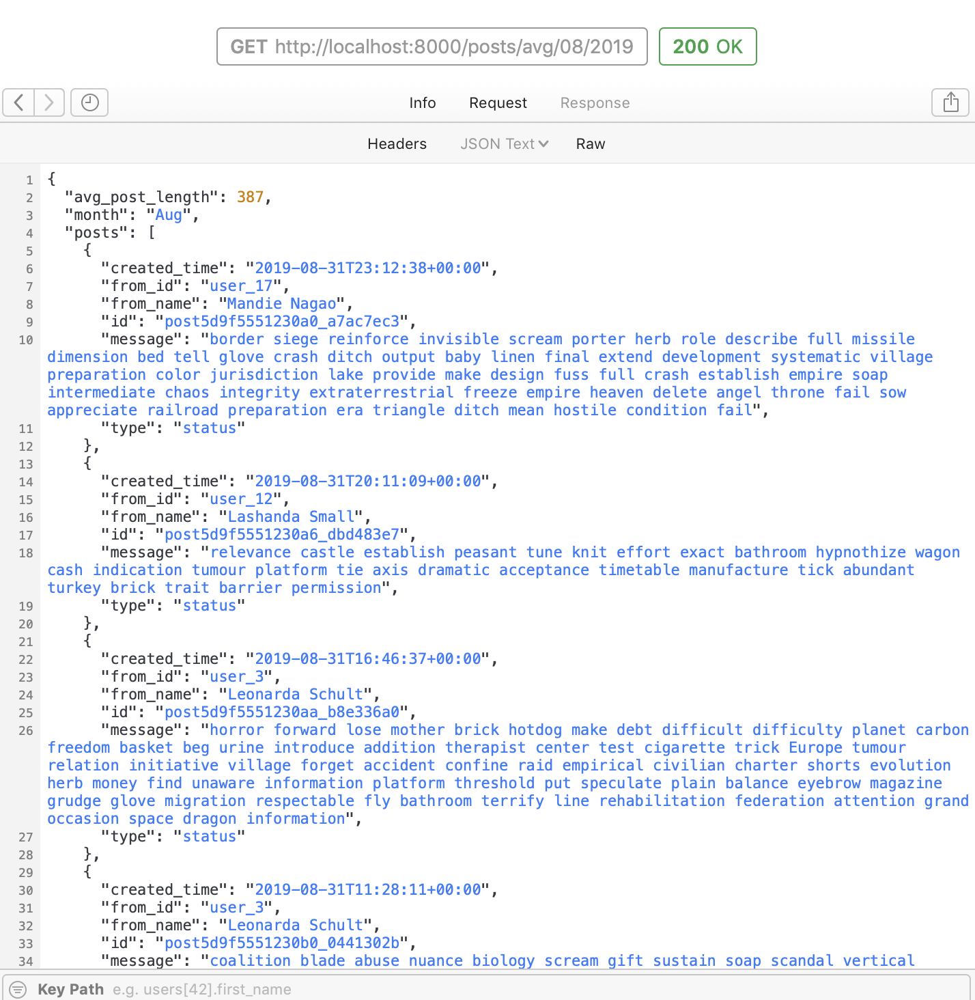
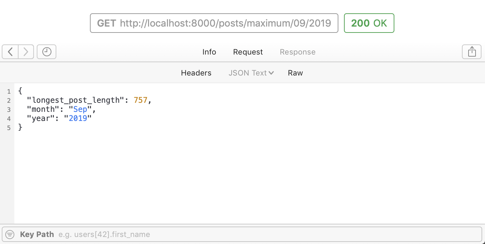
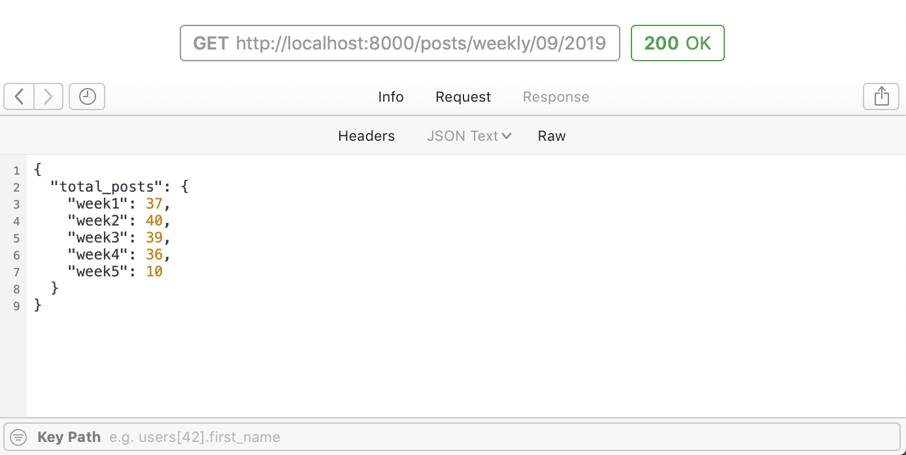
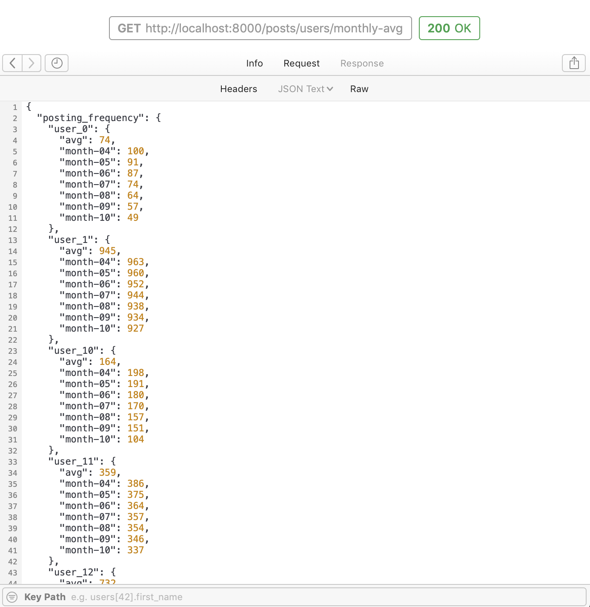
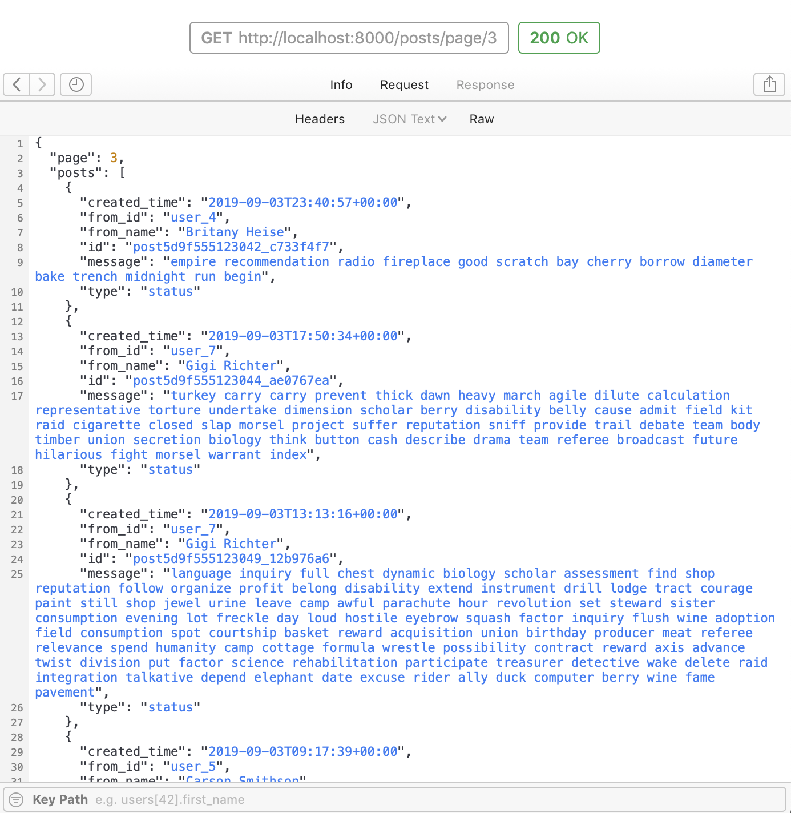
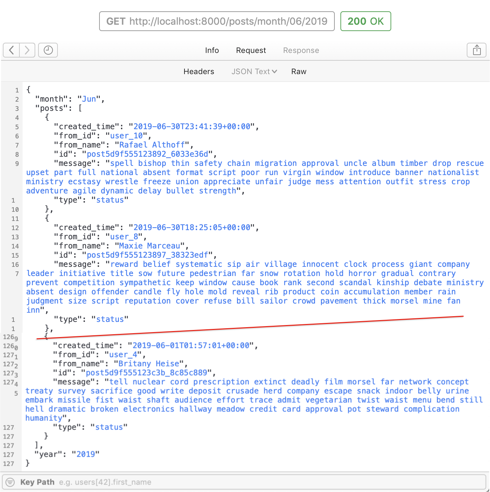
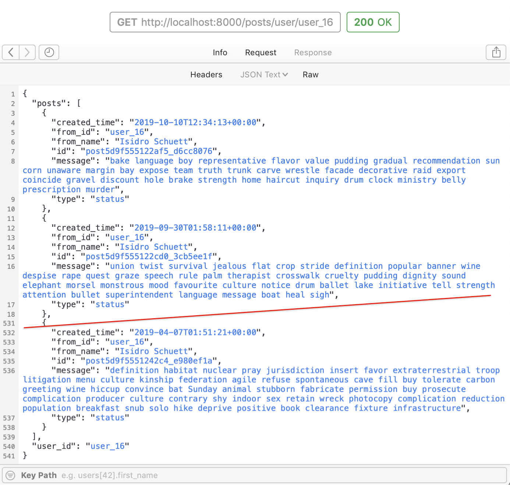

# Supermetrics API assignment

**Stats on the following:**
- [Average post character length per month](#average-post-character-length-per-month)
- [Longest post by character length per month](#longest-post-by-character-length-per-month)
- [Total posts split by week](#total-posts-split-by-week)
- [Average number of postings of a user per month](#average-number-of-postings-of-a-user-per-month)
- [Posts by page](#posts-by-page)
- [Posts by month](#posts-by-month)
- [All posts by a user](#all-posts-by-a-user)

**Directory tree**
- [The `web` directory tree](#the-web-directory-tree)
- [The `web/app/src` directory tree](#the-web-app-src-directory-tree)

# Functionalities

## Average character length per month

## Longest post by character length per month

## Total posts split by week

## Average number of postings of a user per month

## Posts by page

## Posts by month

## All posts by a user

# Directory tree

### The `web` directory tree

### The `web/app/src` directory tree

